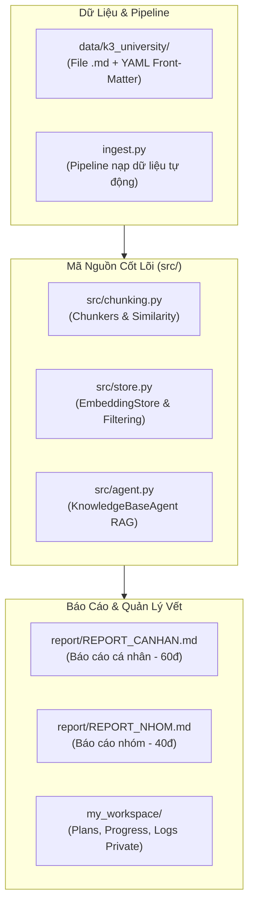

# 📚 Báo Cáo Tổng Quan Dự Án & Trạng Thái Thực Hiện (Project Master Summary)

> **Dự án:** Lab 07 — Nền Tảng Dữ Liệu: Embedding, Chunking & Vector Store  
> **Biến thể K3:** Truy xuất Dịch vụ & Quy định Đại học (University Services Retrieval)  
> **Môi trường:** Python 3.11 | **Bộ kiểm thử:** `pytest tests/ -v` (42 tests)

---

## 📖 1. Tổng Quan & Mục Đích Dự Án (Project Purpose & Context)

### 🎯 Mục Đích Cốt Lõi
Dự án nhằm xây dựng một hệ thống **Retrieval-Augmented Generation (RAG)** từ nền tảng mã nguồn thấp (from scratch) để hiểu sâu cơ chế hoạt động của:
- **Biến đổi văn bản thành Vector (Embedding):** Đo lường khoảng cách ngữ nghĩa giữa các văn bản.
- **Chia nhỏ tài liệu (Chunking):** Tối ưu hóa kích thước thông tin đưa vào kho tri thức.
- **Kho lưu trữ Vector (Vector Store):** Đẩy, tìm kiếm xếp hạngSimilarity, lọc siêu dữ liệu (Metadata Filtering) và xóa tài liệu.
- **Tác tử RAG (KnowledgeBaseAgent):** Kết nối kho tri thức vector với mô hình ngôn ngữ lớn (LLM) để tự động trả lời câu hỏi chính xác theo ngữ cảnh.

### 🏛️ Yêu Cầu Biến Thể K3 Variant
Xây dựng cơ sở tri thức phục vụ **Dịch Vụ & Quy Định Đại Học** (Đăng ký môn học, học phí, học bổng, thư viện, ký túc xá).
- **Metadata Bắt Buộc cho từng tài liệu/chunk:** `audience` (`student`, `faculty`, `staff`), `source_url`, `retrieved_at`, `document_version` và ít nhất 2 thuộc tính mở rộng.
- **Benchmark Quy định K3:** Bộ 5 câu hỏi đánh giá bắt buộc phải có ít nhất 1 câu hỏi lọc theo `metadata_filter={"audience": "student"}`.

---

## 🧠 2. Những Kiến Thức Cần Nắm Vững (Core Learning Objectives)

1. **Độ Tương Tự Cosine (Cosine Similarity):**
   - Công thức: $\cos(\theta) = \frac{\vec{u} \cdot \vec{v}}{\|\vec{u}\| \|\vec{v}\|}$
   - Lý do ưu tiên hơn khoảng cách Euclid: Bỏ qua ảnh hưởng của độ dài văn bản, chỉ đo hướng nghiêng của góc vector trong không gian ngữ nghĩa.
   - Xử lý an toàn: Trả về `0.0` nếu một trong hai vector có độ dài bằng `0` (Zero-division safety).

2. **3 Chiến Lược Chia Nhỏ Văn Bản (Chunking Strategies):**
   - **`FixedSizeChunker`:** Cửa sổ trượt cố định ký tự (`chunk_size`, `overlap`). Đơn giản nhưng có nguy cơ cắt dở từ/câu.
   - **`SentenceChunker`:** Tách theo ranh giới câu (`. `, `! `, `? `). Giữ trọn vẹn 100% ngữ nghĩa câu.
   - **`RecursiveChunker`:** Chia đệ quy theo danh sách ưu tiên `["\n\n", "\n", ". ", " ", ""]`. Cân bằng giữa cấu trúc đoạn và độ dài.

3. **Cơ Chế Tiền Lọc Siêu Dữ Liệu (Metadata Pre-filtering):**
   - Lọc tập tài liệu thỏa mãn điều kiện metadata trước, sau đó mới tính Similarity để tăng độ chính xác và giảm nhiễu rác.

---

## 🏗️ 3. Các Thành Phần Cần Xây Dựng (System Components)

---

## ✅ 4. Những Việc Đã Làm Được (Completed Achievements - Phase 1)

### 🟢 Giai Đoạn 1: Cá Nhân (60% Tổng Điểm) — HOÀN THÀNH 100%

1. **Khởi Tạo Hệ Thống & Rule Agent:**
   - [x] Tạo thư mục private [my_workspace](file:///d:/tai%20lieu%20hoc%20tap/VinAI/Day07/Lap/DAY07_2A202601429_NguyenHuuHieu/my_workspace) (`plans/`, `progress/`, `logs/`) với định dạng YAML Front-Matter & Semantic Versioning.
   - [x] Thêm `my_workspace/` vào [.gitignore](file:///d:/tai%20lieu%20hoc%20tap/VinAI/Day07/Lap/DAY07_2A202601429_NguyenHuuHieu/.gitignore) để đảm bảo không commit lên Git.
   - [x] Cài đặt bộ rules chuẩn cho Agent trong [AGENT_RULES.md](file:///d:/tai%20lieu%20hoc%20tap/VinAI/Day07/Lap/DAY07_2A202601429_NguyenHuuHieu/AGENT_RULES.md), [.clinerules](file:///d:/tai%20lieu%20hoc%20tap/VinAI/Day07/Lap/DAY07_2A202601429_NguyenHuuHieu/.clinerules), [.cursorrules](file:///d:/tai%20lieu%20hoc%20tap/VinAI/Day07/Lap/DAY07_2A202601429_NguyenHuuHieu/.cursorrules).

2. **Hoàn Thiện Mã Nguồn Python (`src/`):**
   - [x] [src/chunking.py](file:///d:/tai%20lieu%20hoc%20tap/VinAI/Day07/Lap/DAY07_2A202601429_NguyenHuuHieu/src/chunking.py): Lập trình thành công `compute_similarity`, `SentenceChunker`, `RecursiveChunker`, và `ChunkingStrategyComparator`.
   - [x] [src/store.py](file:///d:/tai%20lieu%20hoc%20tap/VinAI/Day07/Lap/DAY07_2A202601429_NguyenHuuHieu/src/store.py): Lập trình thành công lớp `EmbeddingStore` (`add_documents`, `search`, `get_collection_size`, `search_with_filter`, `delete_document`).
   - [x] [src/agent.py](file:///d:/tai%20lieu%20hoc%20tap/VinAI/Day07/Lap/DAY07_2A202601429_NguyenHuuHieu/src/agent.py): Lập trình thành công `KnowledgeBaseAgent` thực thi RAG pipeline.

3. **Verification & Kiểm Thử:**
   - [x] **Đạt 42/42 Unit Tests PASSED (100% PASS)** khi chạy `python -m pytest tests/ -v`.
   - [x] Chạy thử nghiệm thành công End-to-End RAG demo với `python main.py "Quy định đăng ký môn học"`.

4. **Báo Cáo Cá Nhân:**
   - [x] Hoàn thành 100% nội dung file [report/REPORT_CANHAN.md](file:///d:/tai%20lieu%20hoc%20tap/VinAI/Day07/Lap/DAY07_2A202601429_NguyenHuuHieu/report/REPORT_CANHAN.md) (Tự đánh giá **60 / 60 điểm**).

---

## 🚀 5. Những Việc Cần Làm Tiếp Theo (Next Action Items - Phase 2)

### 🔵 Giai Đoạn 2: Nhóm & Biến Thể K3 (40% Tổng Điểm)

1. **Thu Thập Tập Tài Liệu K3 (Corpus 5–10 docs):**
   - [ ] Thu thập 5–10 tài liệu `.md` thực tế về Quy định Đại học (đăng ký môn, học phí, học bổng, thư viện, ký túc xá).
   - [ ] Định dạng YAML Front-matter metadata chuẩn K3 (`audience`, `source_url`, `retrieved_at`, `document_version` + 2 thuộc tính mở rộng).

2. **Cấu Hình Local Multilingual Embedder:**
   - [ ] Thiết lập `EMBEDDING_PROVIDER=local` để dùng `sentence-transformers/paraphrase-multilingual-MiniLM-L12-v2` cho đánh giá thực tế.

3. **Thực Hiện Benchmark So Sánh 3 Chiến Lược Nhóm:**
   - [ ] Phân công 3 thành viên thử 3 chiến lược khác nhau (`Sentence`, `Recursive`, `FixedSize Tuned`).
   - [ ] Thống nhất **5 Benchmark Queries + Gold Answers** (có 1 câu chứa `metadata_filter={"audience": "student"}`).
   - [ ] Đo đạc kết quả retrieval, thực hiện **Phân tích lỗi (Failure Analysis)**.

4. **Hoàn Thành Báo Cáo Nhóm & Thuyết Trình:**
   - [ ] Điền đầy đủ thông tin vào file [report/REPORT_NHOM.md](file:///d:/tai%20lieu%20hoc%20tap/VinAI/Day07/Lap/DAY07_2A202601429_NguyenHuuHieu/report/REPORT_NHOM.md).
   - [ ] Chuẩn bị slide thuyết trình & demo kết quả cho nhóm.
